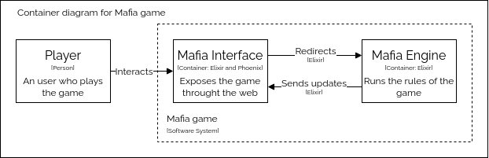
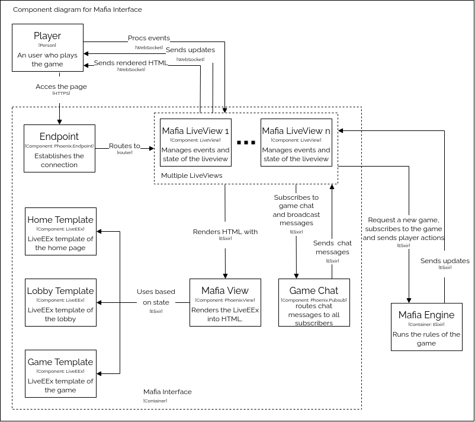
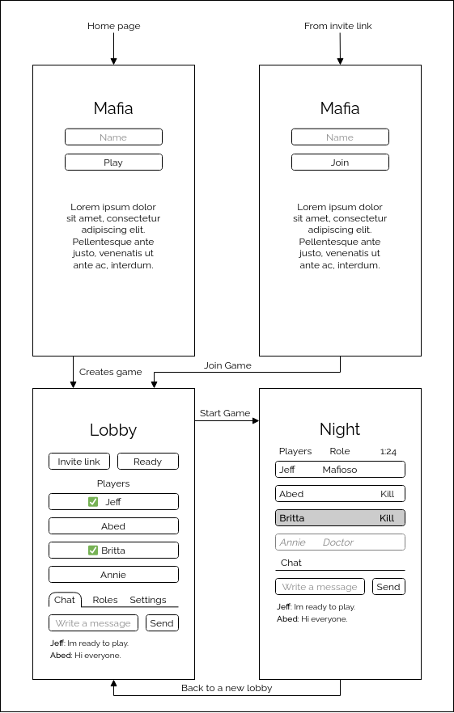

# MafiaInterface

MafiaInterface is a Phoenix inteface for the [Mafia party game](https://en.wikipedia.org/wiki/Mafia_(party_game)) implemented in [MafiaEngine](https://github.com/menxs/mafia_engine).

To start your Phoenix server:

  * Install dependencies with `mix deps.get`
  * Install Node.js dependencies with `npm install` inside the `assets` directory
  * Start Phoenix endpoint with `mix phx.server`

Now you can visit [`localhost:4000`](http://localhost:4000) from your browser.

## Architecture
The MafiaInterface relies on [MafiaEngine](https://github.com/menxs/mafia_engine) to handle the game logic.

 
How the MafiaInterface components work between them.

## Interface
The interface is designed to be as accesible and simple as possible.

